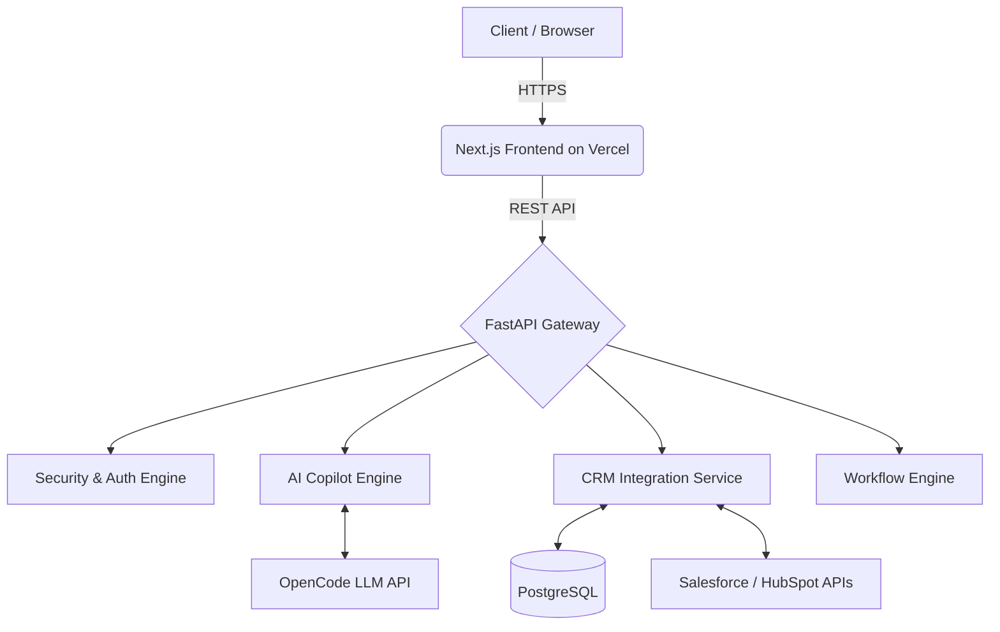

<div align="center">
  
  <h1>Miracle Birds CRM Intelligence</h1>
  <p><strong>The AI Intelligence Layer for Every Enterprise CRM.</strong></p>

  <p>
    <a href="https://miracle-birds-crm-frontend.vercel.app"></a>
    
    
    
    
  </p>
</div>

---

## 🚀 The Vision

Enterprise revenue teams are drowning in data but starving for insights. CRMs like Salesforce and HubSpot are incredibly powerful data silos, but extracting actionable intelligence requires data science teams and weeks of analysis.

**Miracle Birds** bridges the gap. It is an **AI-native intelligence layer** that plugs directly into your existing CRM to predict customer churn, score leads, automate retention workflows, and provide a conversational AI Copilot for your raw data. 

**Stop guessing. Start growing.**

---

## ✨ Core Features

- 🧠 **Predictive Intelligence:** Real-time ML models predict customer churn risk and generate lead health scores.
- 💬 **AI CRM Copilot:** Query your entire pipeline, customer history, and deal metrics using natural language.
- 🔄 **Automated Workflows:** Trigger automated retention playbooks, Slack alerts, and sales sequences based on AI insights.
- 📊 **Customer 360 Profiles:** A unified view of every account, synthesizing data from meetings, emails, and CRM records.
- 🔌 **Universal Connectors:** One-click OAuth integrations for **Salesforce, HubSpot, Zoho CRM, Microsoft Dynamics 365, and Pipedrive**.
- 🛡️ **Enterprise Security & Governance:** Industry-first AI governance dashboard with SOC2/GDPR compliance tracking, full audit logs, and an emergency AI kill-switch.

---

## 🌐 Live Production Links

| Service | Environment | URL |
| :--- | :--- | :--- |
| **Web Application** | Vercel (Prod) | [https://miracle-birds-crm-frontend.vercel.app](https://miracle-birds-crm-frontend.vercel.app) |
| **Backend API** | Render (Prod) | [https://mb-backend-rnhn.onrender.com](https://mb-backend-rnhn.onrender.com) |
| **CRM Integration Svc** | Render (Prod) | [https://mb-crm-integration.onrender.com/health](https://mb-crm-integration.onrender.com/health) |

### 🔑 Demo Access
To explore the live application, use our shared sandbox credentials:
> **Email:** `qy45gkdg5@mozmail.com`
> **Password:** `*L39RDW=P8EVbn>`

*(Note: This is a shared sandbox. Please do not upload sensitive production data).*

---

## 🏗️ Architecture Stack

Miracle Birds is built using a modern, scalable, and decoupled microservices architecture.

* **Frontend:** Next.js 14 (App Router), React, Tailwind CSS, TanStack Query, Zustand, Lucide Icons.
* **Backend:** Python, FastAPI, PostgreSQL, Redis.
* **AI Engine:** OpenCode Zen API (DeepSeek / Nemotron models).
* **Infrastructure:** Vercel (Edge CDN), Render (Managed Services & DBs).



---

## 🛠️ Local Development

### 1. Prerequisites
- Node.js >= 20.x
- Python >= 3.10
- PostgreSQL
- Redis

### 2. Frontend Setup
```bash
cd apps/frontend
npm install
# Copy environment variables
cp .env.example .env.local
npm run dev
```
*Frontend runs on `http://localhost:3000`*

### 3. Backend Setup
```bash
cd apps/backend
python -m venv venv
source venv/bin/activate
pip install -r requirements.txt
# Set required env vars (DATABASE_URL, JWT_SECRET, etc)
uvicorn main:app --reload --port 8000
```
*Backend runs on `http://localhost:8000`*

---

## 🔐 Security Model
We built Miracle Birds to be **secure by design**, keeping enterprise requirements in mind:
- **Zero-Trust Internal APIs:** All microservice-to-microservice communication requires cryptographic `X-Internal-API-Key` headers.
- **Tenant Isolation:** strict row-level security and tenant-scoped JWTs ensure data never bleeds between accounts.
- **Rate Limiting:** Global Redis-backed rate limiting protects against brute force and DDoS.
- **AI Guardrails:** Configurable limits on AI response generation and confident thresholding for automated workflows.

---

<div align="center">
  <p>Built with ❤️ by Team Miracle Birds for the AI for Marketers Hackathon (August 2026).</p>
</div>
